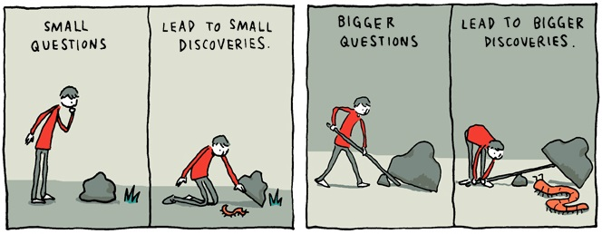

  

## Coding Standards: An Introduction
Beginning programmers often aren't taught the importance of coding standards. At that stage in time, all they really want is for their code to work properly. 
