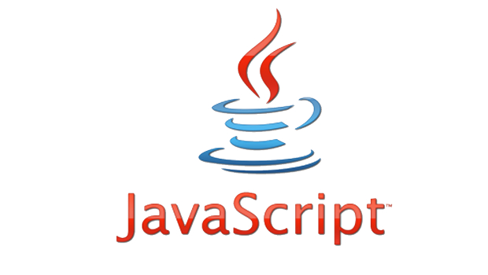

Learning a new language is always a struggle. For example, as a native English speaker, it is very hard learning Japanese. Learning a coding language applies the same way. The first time I learned Java in ICS 111 it almost seemed foreign. Learning all the quirks about programming and learning all the syntax made it very hard. Learning Javascript now however, was surprisingly very easy. 

Javascript is almost exactly like Java, so learning it was very simple. One of the biggest differences is that variables don't need a type (like int or String), which is actually very convienient. There are some other differences from Java (mostly terminology and initializing variables), but otherwise because it is so similar, it was very easy to pick up and learn. Using JSFiddle to write and compile the code is also very easy. One of the difficulties I had was trying to figure out how to output data, but I didn't realize console.log prints to the developer tools console. I was expecting it to work like System.out.println from Java. JSFiddle is very user friendly and even provides a tidy option to help with brackets. 

One thing about Javascript that Java doesn't have is the use of libraries, such as underscore, that allow faster and more efficient programming. Javascript is also a language that is intuitive - it knows what you are declaring and how to represent it. It is a very smart language, almost like combining key concepts of many different programming languages into one!

From a software engineering perspective, I think that Javascript is a good language because it is easily learned and is very similar to the Java programming language. By looking around on the internet, many web applications are all designed through Javascript. Javascript also has "better genes" in the fact that it derivates from better systems than other programs language. It is also one of the fastest growing systems, allowing for more common use between programmers.

One of my goals for this course was to learn how to perform well under pressure. Dr. Johnson's athletic software engineering concept is very useful for that. The best thing about this concept however, is that he gives practice WODs (which are like small programming assignments) so that you can practice for the actual WOD in class. I like how the practice WODs make you incorporate all of the concepts learned in a particular module under a slightly less pressure filled situation. Personally, I really like learning programming languages this way, as in the real world how you handle yourselves in pressure filled situations matters a lot. While the actual WODs are actually a little stressful, the practice WODs eliminate a lot of my pre-WOD jitters by allowing me to practice all the skills in a situation where it matters a lot less.

