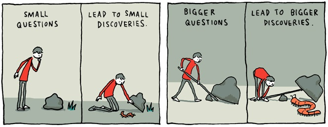

  

## Good vs. Bad Questions
Just the other day, I was sitting in one of my lecture classes. The professor said "Gosh, I can't remember when I had a class that asked so many good questions". Most if not all teachers are always encouraging their students to ask questions, saying things like "No question is ever a bad question, so don't be afraid to ask". However, in the article <a href="http://www.catb.org/esr/faqs/smart-questions.html"> How To Ask Questions the Smart Way</a>, while there may not be such a thing as a bad question, as shown, there are many bad ways to phrase a question.

Asking questions when it comes to coding is a daily practice. No programmer has ever written a perfect program on their first try. Sometimes, the mistakes made are very subtle and it can be hard to find, so they ask someone. However, all programmers are people. They have things that they could be doing, so if acting like a nuisance, they probably will just ignore your question. Some tips that the article lists are:
  1. Do not ask a question that an answer can be easily found by googling it
  2. Don't be rude when asking for a question because there the target audience for the question is other people
  3. Don't act unprofessional or give excuses for yourself

So what kinds of questions are good questions? They are the ones that are concise and to the point. They don't just ask for help. They describe the problem and the steps done already to try and eliminate it. The biggest point from the article, is that good questions don't just beg for help. They don't just say "Here's my problem. What's wrong with it?". They don't just demand an answer. This is very important when it comes to an area like Software Engineering because when developing and deploying software, it is important to understand the process. Again, almost no software engineer ever produced a fully functioning project the way they intended to the first time they made it. Especially when working in a group, the most efficient groups are the ones that when working together ask the efficient questions so that time isn't spent uselessy running through all the lines of code. 

## "Bad" Questions
<a href="https://stackoverflow.com/"> Stack Overflow</a> is a common resource that many programmers use to ask questions about their code or programs. However, it seems as if some programmers don't exactly know how to ask effective questions. Here are some examples of some "bad" questions:

<a href="https://stackoverflow.com/questions/39688289/my-javascript-code-not-working"> Question 1</a>: Just from the title of this question, "my javascript code not working", is kind of a turn off. Who would want to answer a question that is titled that. The asker also says that no errors are given so they don't know what is going on. The responses to him are all very similar, saying that this question really only benefits one person, and that it is a similar repost to another question. While there are some people that did help them out, some responses are also a little rude. This is a prime example of what not to title your question and how not to phrase your question.

<a href="https://stackoverflow.com/questions/35077351/how-i-can-create-mobile-app-of-my-website"> Question 2</a>: This is an example of a question that is a little too broad. The title of this question is "How I can create mobile app of my website". Before an edit in which the user provided a little more details, the user just asks if it is possible to make a mobile app of their website. This is a little too broad, and thus was closed because of it. Also maybe it would've been better if they just googled ways to do this instead of asking this question on Stack Overflow, as there are many websites that can answer this type of question.

## Good Questions
Not all questions on Stack Overflow are bad questions however. Many users actually have very good intentions and ask good questions. Here are some examples of good questions:

<a href="https://stackoverflow.com/questions/11227809/why-is-it-faster-to-process-a-sorted-array-than-an-unsorted-array"> Question 1</a>: This question is not only specific, but it provides insights to other people. This question involves improving runtime by sorting data. The user provides two examples of code, their own experience with the runtime, and asks three very specific questions that are all somewhat related, but not repetitive. Also, this is not really something that is easily searchable on the internet either. Runtimes and speed of a program will come based on experience, which is why giving examples of the code used (and in both C++ and Java) helps to clarify the situation a lot.

<a href="https://stackoverflow.com/questions/1642028/what-is-the-operator-in-c"> Question 2</a>: This is a very interesting question asked. This person clearly did their research before asking the question. They mention reading something and finding out that a specific notation worked out, but was clearly confused on what the actual notation was. This question is something that may have been able to be googled, but at the same time is something that when I first saw I was like "What? That's a thing?". It is a question that many people probably have, and the responses all reflect that: "+1 for being disciplined enough to say WTF and ask :)" being one of them. While the answer to this question has to do with parenthesis and notation, it is a good question to ask because it is appliable to many other instances.

## The Verdict
Asking good questions isn't only useful for programming situations, it could be a huge time saver in everyday life situations. The next time you are in a class and you want to find out how to do problem 1, instead of asking "How do I do Problem 1?", think about a better way of asking "How can I specifically use this formula to solve Problem 1?". This will not only make the answer to the question much more specific and efficient, but it will usually almost always be a question someone else has. Good questions can make everyone's life easier.

