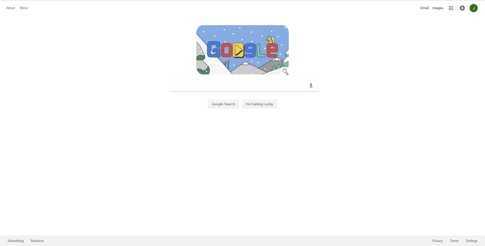
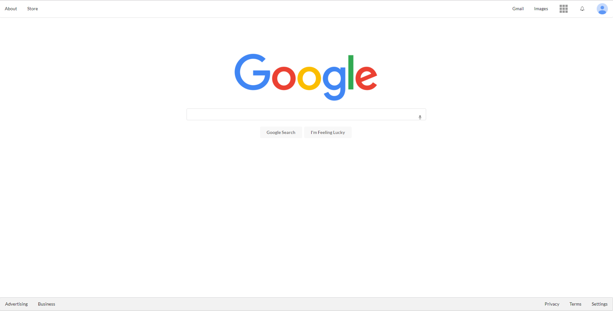

## HTML and UI Frameworks: An Introduction
One of my biggest dreams and aspirations for my computer science degree was to learn how to build a website. However, I never had any prior experience building a website before. When I found out in my Software Engineering class that we were going to learn HTML and CSS I was thrilled. I always wanted to build a highly functional website that looked visually appealing. Semantic UI helps me to fulfill that goal. With the use of certain keywords (such as icon or menu), Semantic UI provides an easy and fresh way to implement HTML UI Frameworks in a way that it almost feels like cheating.

## Semantic UI: The Struggle
Semantic UI gives so many different options to make a website more user-friendly. It allows you to add menus, dropdown items, containers for formatting, and even common icons that people see on many different websites. However, it does not come without its share of struggles. Because one has to first implement the class libraries used for Semantic UI, it can be easy to forget especially if previous projects have used it. Personally, for one of my class assignments I couldn't figure out why nothing was loading before I realized I forgot to implement the library.

The biggest challenge, however, comes from having to learn the keywords and what each keyword means. For example, to add a container in the html file, one would have to code:

```js
<div class="ui container"></div>
```

There are many other class names that are similar to this. For example, one can add the keyword "fluid" to the above class to create a container that would encompass the entire page. Also, one could create a custom subclass that could then be styled using CSS. Luckily, Semantic UI has a website that gives the source code that can be used to implement all of its features. This is very helpful when trying to find the specific function that Semantic UI has to offer.

One other struggle that comes with UI Framework design comes with styling and formatting all the elements using CSS. The spaces rule (differentiating between .classA.classB and .classA .classB) tripped me up when it came to changing the color of fonts. Also just getting used to the whole styling using CSS format, but now with Semantic UI is a struggle. Font sizes, color, background color, text alignment, etc. are all much easier to style in raw HTML rather than Semantic UI.

## Semantic UI: The Payoff
Despite all of the struggles and while there is initially a big learning curve for Semantic UI, the payoff is actually quite amazing. Semantic UI allows almost perfect recreation of many websites. For example, I was able to recreate the UI of Google.

<div class="ui rounded images">
  
  
</div>

The Original page is the top image, and the remade page is the bottom. I had not yet learned how to insert animations into an html document yet, which is why there is no theme on the remade page. However, otherwise the products look very similar and it is very impressive how Semantic UI allows the user to almost perfectly recreate very nice and user-friendly webpages. All of the icons in the remade version are from Semantic UI's icon library, and creating different containers that were fluid allowed me to balance out the webpage as fit.


## Semantic UI: The Verdict
I have created other mockup websites as well, such as Murphy's Bar and Grill, Hard Rock Cafe, and Island Snow. However, the biggest payoff of Semantic UI is not creating mockups of nice websites. The biggest payoff is the ability to KNOW how to recreate it. Semantic UI allows one to browse the web aimlessly, find a website they like, and then know how to create a website similar to that one. Dropdowns, menus, icons, the ability to style to your heart's consent are just some things that learning UI Frameworks allows one to do to their websites. While the initial learning curve may be very similar to learning a new programming language as it is filled with many new keywords, the payoff is huge for creataing a very user-friendly and visually appealing website.


