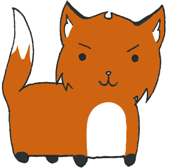
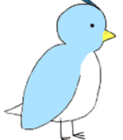

<div class="ui small rounded images">
  
  
</div>

Birdo does a Fly is a "Temple Run" like game that involves a bird having to jump or duck under obstacles to avoid being captured by a fox. The game randomly selects either a rock or a vine that the player will have to jump over or slide under to avoid being captured by a fox. The player either has to press 'W' to jump or 'S' to slide. Each object has a specific hitbox that was calculated based on the dimensions of the image, so the keys have to be pressed at the correct time to avoid colliding with the hitboxes.

This was a group project. My partner for this project was Matthew Yamaguchi. My specific role on this project was to create the hitboxes for the objects and the bird. I was also responsible for randomizing the obstacles. It was a lot of trial and error, as the bird died too early in some cases, and didn't die at all in other cases.

Through this project, one of the skills that had to be utilized was teamwork. I thought Matt and I worked very well together and we ended up helping each other debug the parts we needed help with. He helped a lot with the design and implementation of the different states of the bird, while I did a lot of the math and calculations.

Here is some code that illustrates how the hitboxes were calculated:

```js
if (bush.didHit(bird.getWalkX() - 77, bird.getWalkY() - 88)
						|| bush.didHit(bird.getWalkX() + 77, bird.getWalkY() - 88)
						|| bush.didHit(bird.getWalkX() - 77, bird.getWalkY() + 88)
						|| bush.didHit(bird.getWalkX() + 77, bird.getWalkY() + 88)) {
					bird.dead();
					alive = false;
```

Source: <a href="https://github.com/jkasuya/ICS111FinalProject"><i class="large github icon"></i>jkasuya/ICS111FinalProject</a>


